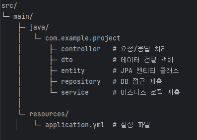

# 일정 관리 앱 만들기 과제

스프링 부트에서 CRUD API를 구현하고, Postman으로 테스트 가능한 일정 관리 시스템입니다.  
lv1 ~ lv4로 CRUD API가 구현되었습니다.

---

## 목차
- [프로젝트 개요](#프로젝트_개요)
- [기술 스택](#기술_스택)
- [패키지 구조](#패키지_구조)
- [ERD](#ERD)
- [API 명세서](#API_명세서)
- [lv1 ~ lv4 요약](#lv1--lv4-요약)
- [클래스별 역할 및 기능](#클래스별-역할-및-기능)

---

## 프로젝트 개요

[**프로젝트 목적**] 
 - 3 레이어 아키텍처 개념과 각 계층의 역할을 이해하고 실제 애플리케이션 설계에 적용을 위한 일정 관리 앱 구현

[**주요 학습 목표**]
- CRUD API 구현
- Postman 활용한 테스트
- MySQL / JPA 활용(데이터 CRUD)
- Spring MVC 어노테이션 이용해 요청 및 컨트롤러 메서드 매핑
- @RestController, @Service, @Repository 기능 활용

---

## 기술 스택
- Language: Java 17
- Framework : Spring Boot
- Database : MySQL, JPA
- IDE : IntelliJ IDEA
- API Test Tool : Postman


---

## 패키지 구조



---

## ERD
아래 사진은 프로젝트의 ERD 입니다.


---

## API 명세서

| 기능                      | Method | URL                          | Request                                                                                                 | Response |
|---------------------------|--------|------------------------------|---------------------------------------------------------------------------------------------------------|----------|
| 일정 생성하기             | POST   | `/schedules`                 | ```json { "title": "string", "content": "string", "name": "string", "password": "string" } ```          | **201 Created**<br>```json { "id": Long, "title": "string", "content": "string", "name": "string", "createdAt": "datetime", "updatedAt": "datetime" } ``` |
| 일정 전체 조회하기        | GET    | `/schedules`                 | -                                                                                                       | **200 OK**<br>```json [ { "id": Long, "title": "string", "content": "string", "name": "string", "createdAt": "datetime", "updatedAt": "datetime" } ] ```<br>없으면 `[]` |
| 일정 단건 조회하기        | GET    | `/schedules/{scheduleId}`    | PathVariable: `scheduleId`                                                                              | **200 OK**<br>```json { "id": Long, "title": "string", "content": "string", "name": "string", "createdAt": "datetime", "updatedAt": "datetime" } ```<br>**404 Not Found**: 해당 일정 없음 |
| 일정 제목, 이름 수정하기 (덮어쓰기) | PUT    | `/schedules/{scheduleId}`    | PathVariable: `scheduleId`<br>```json { "title": "string", "name": "string", "password": "string" } ``` | **200 OK**<br>```json { "id": Long, "title": "string", "name": "string" } ```<br>**404 Not Found**<br>**400 Bad Request**: 비밀번호 불일치 |
| 일정 삭제하기             | DELETE | `/schedules/{scheduleId}`    | PathVariable: `scheduleId`<br>```json { "password": "string" } ```                                      | **200 OK**<br>```json { "message": "삭제 완료" } ```<br>**404 Not Found**<br>**400 Bad Request**: 비밀번호 불일치 |


---

## lv1 ~ lv4 요약

[lv1. CRUD의 "C" - 일정 생성]
- 일정 제목, 일정 내용, 작성자명, 비밀번호, 작성/수정일 저장
- 작성/수정일은 날짜와 시간 모두 포함 (최초생성시 동일)
- 각 일정 고유 식별자(ID)를 자동으로 생성/관리
- 작성/수정일 필드는 JPA Auditing 활용
- API 응답에 비밀번호 제외


[lv2. CRUD의 "R" - 일정 조회]
- 작성자명 기준으로 등록된 일정 목록 전부 조회 (하나의 API)
- 수정일 기준 내림차순 정렬
- API 응답에 비밀번호 제외


[lv3. CRUD의 "U" - 일정 수정]
- 일정 제목, 작성자명 만 수정가능
- 일정 수정 요청 시, 비밀번호 함께 전달
- 작성일 변경 불가 
- 수정일은 수정 완료 시 변경
- API 응답에 비밀번호 제외


[lv4. CRUD의 "D" - 일정 삭제]
- 선택한 일정 삭제
- 일정 삭제 요청 시, 비밀번호 함께 전달


---

## 패키지별 역할 및 기능

[controller]
- 클라이언트 요청을 받아 Service 계층에 전달/응답 반환
- API 제공 (CRUD)
    - `POST /schedules` : 일정 생성
    - `GET /schedules` : 전체 일정 조회
    - `GET /schedules/{scheduleId}` : 단건 일정 조회
    - `PUT /schedules/{scheduleId}` : 일정 수정
    - `DELETE /schedules/{scheduleId}` : 일정 삭제
   

[dto]
- 요청/응답 데이터 전달 객체
- 비밀번호는 응답에서 제외 (보안성 확보)
 

[entity]
- 데이터베이스 테이블과 매핑되는 클래스
- JPA Entity로 정의


[repository]
- DB 접근 계층
- Spring Data JPA 사용 (CRUD 메서드 제공)


[service]
- 비즈니스 로직 처리 계층
- 트랜잭션 관리
- 주요기능(생성/전체조회/단건조회/수정/삭제)
- 수정/삭제 시 비밀번호 검증 포함

---