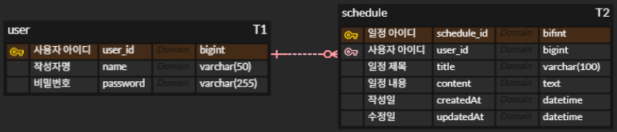

# 일정 관리 앱 만들기 과제

스프링 부트에서 CRUD API를 구현하고, Postman으로 테스트 가능한 일정 관리 시스템입니다.  
lv1 ~ lv4로 CRUD API 가 구현되었습니다.

---

## 목차
- [소개](#소개)
- [ERD](#ERD)
- [API 명세서](#API_명세서)
- [lv1 ~ lv4 요약](#lv1--lv4-요약)
- [클래스별 역할 및 기능](#클래스별-역할-및-기능)
- [실행 예시](#실행-예시)

---

## 소개

이 프로그램은 일정 관리를 스프링부트를 이용해 구현한 예제입니다.

필수 기능은 CRUD API 구현입니다. (생성/조회/수정/삭제)
작성일, 수정일 필드는 JPA Auditing을 활용하여 적응하며,
일정 생성, 조회, 수정에서 비밀번호는 API 응답에서 제외해야 합니다.

---

## ERD
아래 사진은 프로젝트의 ERD 입니다.


---

## API 명세서

| 기능                      | Method | URL                          | Request                                                                                                 | Response |
|---------------------------|--------|------------------------------|---------------------------------------------------------------------------------------------------------|----------|
| 일정 생성하기             | POST   | `/schedules`                 | ```json { <pre><code> "title": "string", <pre><code>"content": "string", <pre><code>"name": "string", <pre><code>"password": "string" <pre><code>} ```     | **201 Created**<br>```json { "id": Long, "title": "string", "content": "string", "name": "string", "createdAt": "datetime", "updatedAt": "datetime" } ``` |
| 일정 전체 조회하기        | GET    | `/schedules`                 | -                                                                                                       | **200 OK**<br>```json [ { "id": Long, "title": "string", "content": "string", "name": "string", "createdAt": "datetime", "updatedAt": "datetime" } ] ```<br>없으면 `[]` |
| 일정 단건 조회하기        | GET    | `/schedules/{scheduleId}`    | PathVariable: `scheduleId`                                                                              | **200 OK**<br>```json { "id": Long, "title": "string", "content": "string", "name": "string", "createdAt": "datetime", "updatedAt": "datetime" } ```<br>**404 Not Found**: 해당 일정 없음 |
| 일정 제목, 이름 수정하기 (덮어쓰기) | PUT    | `/schedules/{scheduleId}`    | PathVariable: `scheduleId`<br>```json { "title": "string", "name": "string", "password": "string" } ``` | **200 OK**<br>```json { "id": Long, "title": "string", "name": "string" } ```<br>**404 Not Found**<br>**400 Bad Request**: 비밀번호 불일치 |
| 일정 삭제하기             | DELETE | `/schedules/{scheduleId}`    | PathVariable: `scheduleId`<br>```json { "password": "string" } ```                                      | **200 OK**<br>```json { "message": "삭제 완료" } ```<br>**404 Not Found**<br>**400 Bad Request**: 비밀번호 불일치 |


---

## lv1 ~ lv4 요약

[lv1. CRUD의 "C" - 일정 생성]
- 일정 제목, 일정 내용, 작성자명, 비밀번호, 작성/수정일 저장
- 작성/수정일은 날짜와 시간 모두 포함 (최초생성시 동일)
- 각 일정 고유 식별자(ID)를 자동으로 생성/관리
- 작성/수정일 필드는 JPA Auditing 활용
- API 응답에 비밀번호 제외


[lv2. CRUD의 "R" - 일정 조회]
- 작성자명 기준으로 등록된 일정 목록 전부 조회 (하나의 API)
- 수정일 기준 내림차순 정렬
- API 응답에 비밀번호 제외


[lv3. CRUD의 "U" - 일정 수정]
- 일정 제목, 작성자명 만 수정가능
- 일정 수정 요청 시, 비밀번호 함께 전달
- 작성일 변경 불가 
- 수정일은 수정 완료 시 변경
- API 응답에 비밀번호 제외


[lv4. CRUD의 "D" - 일정 삭제]
- 선택한 일정 삭제
- 일정 삭제 요청 시, 비밀번호 함께 전달


---

## 패키지별 역할 및 기능

[controller]
- 

[dto]
- 

[entity]
- 

[repository]
- 

[service]
- 

---

## 실행 예시

1. 
2. 
3. 


---

